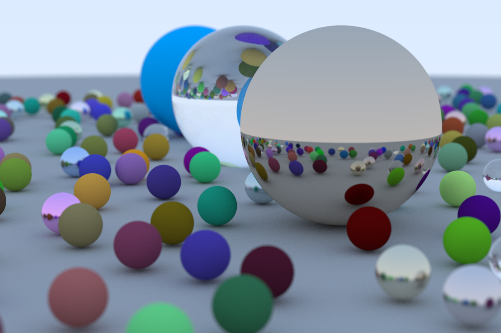

# rayzer

A multi-threaded path tracer written in Rust, based off the [build a raytracer in one weekend guide](https://raytracing.github.io/books/RayTracingInOneWeekend.html). Written from scratch using only minimal dependencies (i.e., `rand`, `png`, `lazy_static`)

An example render:

